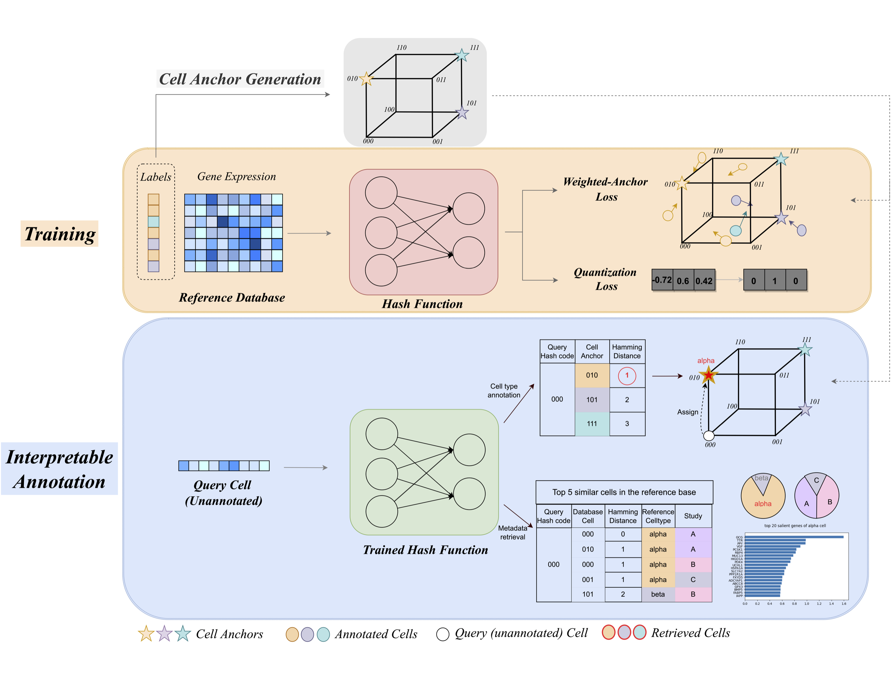

# scHash - interpretable cell type annotation for atlas-level scRNA-seq datasets
scHash is an accurate, efficient, and interpretable deep hashing-based method that can build multi-million reference database and annotate tens of thousands of cells within seconds.


## :heavy_plus_sign: Method
scHash consists of three sequential steps. (1) Cell anchor generation. scHash generates $K$-bit hash code for each unique cell type in the reference database, which is referred as ``cell anchors''. (2) Hash function training}. scHash trains a deep hash function that maps raw gene expression to $K$-bit binary hash code subject to weighted cell-anchor loss and quantization loss. (3) Interpretable cell type annotation. 

scHash can efficiently annotate large-scale scRNA-seq dataset and offer interpretability for its annotation through the metadata of most similar reference cells and saliency map.

<br>

## :triangular_ruler: Requirements and Installation
* Linux/Unix
* Python 3.8

## Installation. 
```bash
$ pip install scHash
```

## Example Usage

We demonstrate how scHash encode multiple datasets into hash codes for six public avaialble Pancreas datasets.

The raw data for first five datasets can be obtained from [Harmony](https://github.com/immunogenomics/harmony2019/tree/master/data/figure5).

The sixth Pancreas dataset Wang is public available at GSE83139.

We compiled the six datasets into one AnnData object for easy demonstration. The processed data can be downloaded [here]().

```python
# load required package
import anndata as ad
from scHash import *

# load data path
data_dir = '../../../share_data/Pancreas_Wang/fivepancreas_wang_raw.h5ad'

# This data contains both the reference and query source
data = ad.read_h5ad(data_dir)

# Split the reference and query data. 
# We use Segerstolpe(smartseq) for query as demonstration. 
# You could specify your query datasets.
train = data[data.obs.dataset != 'smartseq']
test = data[data.obs.dataset == 'smartseq']

# set up datamodule
# the Cross_DataModule takes an anndata object for the input.
# Both reference and query need to be stores in this format to be used for scHash.
datamodule = Cross_DataModule(train_data = train, cell_type_key='cell_type')
datamodule.setup()
N_CLASS = datamodule.N_CLASS
N_FEATURES = datamodule.N_FEATURES

# set the query data
# this can be also set after train
datamodule.test_data = test


# Init ModelCheckpoint callback
checkpointPath = '../checkpoint/'

# Defining Training Model
checkpoint_callback = ModelCheckpoint(
                            monitor='Val_F1_score_median_CHC_epoch',
                            dirpath=checkpointPath,
                            filename='scHash-{epoch:02d}-{Val_F1_score_median_CHC_epoch:.3f}',
                            verbose=True,
                            # save_last = True,
                            mode='max'
                            )
early_stopping_callback = EarlyStopping(monitor="Val_F1_score_median_CHC_epoch")
start = time.time()
trainer = pl.Trainer(max_epochs=200,
                    gpus=1,
                    check_val_every_n_epoch=10,
                    progress_bar_refresh_rate=50,
                    callbacks=[checkpoint_callback]
                    )
print("Number of Feature: ", N_FEATURES)
model = scHashModel(N_CLASS, N_FEATURES)

# Train and Fit the Model
trainer.fit(model = model, datamodule = datamodule)

# Test the best model
best_model_path = checkpoint_callback.best_model_path
best_model = scHashModel.load_from_checkpoint(best_model_path, n_class=N_CLASS,n_features=N_FEATURES)

# Test the model with the query data
trainer.test(model=best_model, datamodule=datamodule)
```


